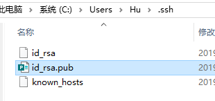

## Github 的使用笔记

[TOC]

### 注册登录github

### 创建新的仓库

* 点击“New repository”创建一个新的仓库：

  * 仓库名称，与后期的仓库地址有关

    

    

  * 仓库描述

    

  <br>
  
  ------Description：添加仓库说明，不是必填项
  
  ------Public、Private：选择公开还是非公开仓库，但是非公开仓库目前是收费的
  
  ------Initialize this repository with a README：如果选中此项，随后Github会自动初始化仓库并设置README文件，让用户可以立即clone此仓库。如果想向Github添加手中已有的Git仓库，建议不要勾选，直接手动push
  
  ------Add.gitignore：初始化自动生成.gitignore文件（该文件用来描述Git仓库中不需要管理的文件与目录）省去了每次根据框架进行设置的麻烦
  
  ------Add a license：选择要添加的许可协议文件。
  
  <br>
  
  这样我们就得到了仓库的http以及ssh的地址：
  
  
<br>


####  …or create a new repository on the command line

```
echo "# GithubUserbook" >> README.md
git init
git add README.md
git commit -m "first commit"
git remote add origin https://github.com/weihuohuayi/GithubUserbook.git
git push -u origin master
```
<br>


####  …or push an existing repository from the command line
```
git remote add origin https://github.com/weihuohuayi/GithubUserbook.git
git push -u origin master
```
#### <br>


#### …or import code from another repository

You can initialize this repository with code from a Subversion, Mercurial, or TFS project.

[Import code](https://github.com/weihuohuayi/GithubUserbook/import)

<br>


### 下载Git并同步GitHub

点击https://git-for-windows.github.io/进入Windows版本的Git下载，安装

<br>

#### 在本地创建ssh key：

* 右键 → git-bash
* 设置SSH_Key

$ ssh-keygen -t rsa -C ["**your_email@youremail.com**](mailto:"your_email@youremail.com)"

使用自己注册时候的邮箱



* 查看秘钥

  cat ~/.ssh/id_rsa.pub

  打开id_rsa.pub 获得自己的密匙
<br>


#### Github添加公开秘钥：

* 返回github，进入 Account Settings（账户配置），左边选择SSH and GPG Keys选项：

  
  
  ​	title随便起个名字即可，key是第二步中的内容
  
  ​	成功后出现指纹 Fingerprint
  
  
  
  
  
  * 为什么GitHub需要SSH Key呢？
  
    因为GitHub需要识别出你推送的提交确实是你推送的，而不是别人冒充的，而Git支持SSH协议，所以，GitHub只要知道了你的公钥，就可以确认只有你自己才能推送。
  
  * 当然，GitHub允许你添加多个Key
  
    假定你有若干电脑，你一会儿在公司提交，一会儿在家里提交，只要把每台电脑的Key都添加到GitHub，就可以在每台电脑上往GitHub推送了。

#### 本地验证是否绑定本地成功

* 在git-bash中验证，输入指令：
  $ ssh -T git@github.com
  如果第一次执行该指令，则会提示是否continue继续，如果我们输入yes就会看到成功信息：

#### 配置gitbash本地客户端

*  <font color='Brown'>**设置姓名和邮箱地址**</font>

  * 由于GitHub每次执行commit操作时，都会记录username和email，所以要设置它们：

    git config --global user.name 'yourname'

    git config --global user.email 'youremail@youremail.com'

* 提高，命令输出的可读性

  git config --global color.ui auto

#### 连接仓库

1. Github仓库的项目的路径


2. 创建本地仓库并上传github

   * 我们需要将本地仓库上传至GitHub
     * 建立本地仓库
     * 创建了一个名为“img”的文件夹
     * 其下创建一些文件
     * 文件夹内右键 → git-bash
   
   
   
   * 在本地创建一个文件
   
     * *echo* : 输出文字到控制台
     * echo "# GithubUserbook": 输出文字标题‘GithubUserbook’到控制台，并赋值到README文件
   
   * 初始化本地仓库
   
     * git init
   
     * 得到一个隐藏的.git文件夹，该文件夹是Git用来跟踪管理版本库的
   
       
   
   * 添加README文件到本地仓库
   
     * git add README.md
   
   * 添加这一步的注释
   
     * git commit -m "first commit"
   
   * git add 将文件假如暂存区，在通过git commit 命令提交，添加成功后，可以通过git log命令查看提交日志
   
   * 远程库的地址
   
     * 
     * https://github.com/weihuohuayi/GithubUserbook.git
   
   * 推送

     * git push -u origin master
   
        ```
        echo "# GithubUserbook" >> README.md
        git init     //把这个目录变成Git可以管理的仓库
        git add README.md      //文件添加到仓库
        git commit -m "first commit"//-m参数后的"First commit"称作提交信息，是对此次提交的描述
        git status //查看提交后的状态,一般可跳过
        git remote add origin https://github.com/weihuohuayi/GithubUserbook.git
        git push -u origin master   //把本地库的所有内容推送到远程库上
        ```
     
     
     
     <font color='Brown'>**推送成功 !**</font>
   
3. 将所有文件添加到仓库，并推送到Github

   ```
   git add .
   git commit -m "初次添加本文件夹所有文件到本地仓库"
   ```

   完成本地仓库的文件添加，初步建全文件

4. 本地仓库关联GitHub的仓库

   ```
   git remote add origin https://github.com/weihuohuayi/GithubUserbook.git
   ```

   

5. 提交文件，同步仓库

   ```
   git push -u origin master
   ```

   将本地的`master`分支推送到`origin`主机，-u 表示指定了`origin`为默认主机。
   
   ```
   git push origin master
   ```
   
   完成了默认主机指定后，就可以单纯使用`git push`推送了。


### 文件的维护
#### 文件的修改与提交

当完成所有文件的初始提交后，下一步我们会对文件内容进行修改更新。于是需要将本地更新文件进行远程同步。

1. 文件修改
   * 打开文档，添加信息，保存退出
2. 查看本地库中文件的状态
   * git status    告诉你有哪个文件被修改过
   * git diff    可以查看修改内容
3. 提交修改
   * git add
   * git commit -m ''
4. 查看提交日志
   * git log

#### 克隆远程库
```
git clone git@github.com:weihuohuayi/gitbook.git
```


### git的文件递交pipeline

```
1. git init //初始化仓库
2. git remote add origin + 远程仓库地址 //链接远程仓库，创建主分支
3. git pull origin master // 把本地仓库的变化连接到远程仓库主分支
4. 添加或修改文件
5. git add .(文件name) //添加文件到本地仓库
6. git push -u origin master //把本地仓库的文件推送到远程仓库
```


### 分支管理

https://www.liaoxuefeng.com/wiki/896043488029600/896954848507552


