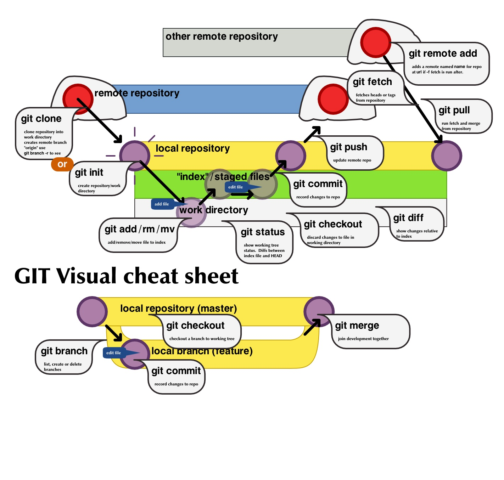

::: tip Git

版本控制工具

:::




## Git Flow

> Git Flow 是什么
>
> Git Flow 是一个基于 Git 的开发流程管理的模型, 因极其适合多人协作有效地进行并行开发而被广泛用于项目流程的源代码管理.

- 在版本回退里，每次提交，Git都把它们串成一条时间线，这条时间线就是一个分支。

   - 截止到目前，只有一条时间线，在Git里，这个分支叫主分支，即master分支。
   - <font color='blue'>HEAD严格来说不是指向提交，而是指向master，</font>master才是指向提交的，所以，HEAD指向的就是当前分支。

- Gitflow 工作流是目前非常成熟的一个方案，它打破单支模型工作流，定义了一个围绕项目发布的严格<font color='blue'>分支模型</font>，通过为代码研发、项目发布以及维护分配独立的分支来让项目的迭代过程更加地顺畅

- 不同于之前的集中式工作流以及功能分支工作流，gitflow 工作流常驻的分支有两个：<font color='blue'>主干分支 master、开发分支 dev</font>，此外针对项目研发的各个阶段，设定了特定的分支。

- > **阶段分支**常驻 master、dev 研发 feature 热修复 hotfix 发布 release等，见下图

- 


## 分支模型优势

> ### 场景设定：基于master分支的代码，开发一个新的特性

- :notebook_with_decorative_cover: 如果你直接在master分支上开发这个新特性，是不好的
   - 万一你在开发`特性1`的时候，领导突然又要叫你去开发`特性2`，就不好处理了。
   - 难道开发的两个特性都提交到master？一会儿提交特性1的commit，一会儿提交特性2的commit？这会导致commit记录很混乱。
- 所以，建议的做法是：给每个特性都单独建一个的新的分支。
- 


## Git Flow规定的常见分支


从上图可以看到主要包含下面几个分支：

- `master` : **主分支**，创建完仓库自动生成master分支， 主要用来版本发布，正式上线，用户使用的版本。
- `develop`：**日常开发分支**，该分支正常保存了开发的最新代码，更新功能A、B、C。测试工程师主要在该分支工作。
- `feature`：具体的功能开发分支，只与 develop 分支交互，分别产生功能A，功能B，功能C不同的feature。开发工程师往往在该分支上工作。
- `release`：`release`分支可以认为是`master` 分支的未测试版。比如说某一期的功能全部开发完成，那么就将 `develop` 分支合并到 `release` 分支，测试没有问题并且到了发布日期就合并到`master` 分支，进行发布。
- `hotfix`：线上 bug 修复分支。做补丁。
- 除此之后还可以有 `fast-track` 等分支。


##### 主分支

主分支包括 `master` 分支和 `develop` 分支。`master` 分支用来发布，`HEAD` 就是当前线上的运行代码。`develop`分支就是我们的日常开发。使用这两个分支就具有了最简单的开发模式：`develop`分支用来开发功能，开发完成并且测试没有问题则将 `develop`分支的代码合并到 `master`分支并发布。


这引入了几个问题：

`develop`分支只有发布完了才能进行下一个版本开发，开发会比较缓慢。
 线上代码出现 bug 如何进行 bug 修复。
 带着这两个问题往下看。

##### 辅助分支

主要介绍的辅助分支如下：
 `feature`分支
 `release`分支
 `hotfix`分支
 通过这些分支，我们可以做到：团队成员之间并行开发，`feature track`更加容易，开发和发布并行以及线上问题修复。

###### Feature 分支

**`feature`分支用来开发具体的功能，一般 fork 自 `develop`分支，最终可能会合并到`develop`分支。**比如我们要在下一个版本增加`功能1`、`功能2`、`功能3`。那么我们就可以起三个`feature`分支：`feature1`，`feature2`，`feature3`。（`feature`分支命名最好能够自解释，这并不是一种好的命名。）随着我们开发，`功能1`和`功能2`都被完成了，而`功能3`因为某些原因完成不了，那么最终 `feature1` 和 `feature2`分支将被合并到 `develop`分支，而 `feature3`分支将被干掉。


## 分支操作与应用

### 一、查看分支

~~~bash
# 列出所有本地分支
$ git branch

# 列出所有远程分支
$ git branch -r

# 列出所有本地分支和远程分支
$ git branch -a
~~~


### 二、创建分支

首先，我们来创建dev分支，然后切换到dev分支上。如下操作：

- ~~~bash
   $ git branch dev         //创建dev分支
   $ git checkout dev       //切换到dev分支
   
	$ git branch
   * dev
     master

   $ git checkout –b dev     //创建指定分支+切换当前分支到指定分支上

   $ git merge name          //合并某分支到当前分支(一般会先切换到master分支上，再合并其他分支)
   $ git branch –d name      //删除分支
   ~~~


### 三、合并分支

- 快速合并
   - 
   -  
- 非快速合并（不同分支对同一内容进行了不同的修改后，进行合并时候，会发生冲突）
   - 
   - 


#### 案例应用

比如说，我专门建立一个`特性1`，为其建一个分支`feature_item_recommend`。具体做法如下：

- （1）基于master分支，创建一个新的分支，起名为`feature_item_recommend`：

```bash
$ git checkout -b feature_item_recommend

Switched to a new branch 'feature_item_recommend'
```

上面这行命令，相当于：


```bash
$ git branch feature_item_recommend    // 创建新的分支

$ git checkout feature_item_recommend  //切换到新的分支
```

- （2）在新的分支`feature_item_recommend`上，完成开发工作，并 commit 、push。

- （3）将分支`feature_item_recommend`上的开发进度**合并**到master分支：

```bash
$ git checkout master  //切换到master分支

$ git merge feature_item_recommend    //将分支 feature_item_recommend 的开发进度合并到 master 分支

```


合并之后，`master`分支和`feature_item_recommend`分支会指向同一个位置。


（3）删除分支`feature_item_recommend`：

> 既然 特性1 开发完了，也放心地提交到master了，那我们就可以将这个分支删除了。

```
git branch -d feature_item_recommend
```

注意，我们当前是处于`master`分支的位置，来删除`feature_item_recommend`分支。如果当前是处于`feature_item_recommend`分支，是没办法删除它自己的。

同理，当我转身去开发`特性2`的时候，也是采用同样的步骤。


### 合并分支时，如果存在分叉


比如说上面这张图中，最早的时候，master分支是位于`C2`节点。我基于`C2`节点，new出一个新的分支`iss53`，我在`iss53`上提交了好几个commit。

现在，我准备把`iss53`上的几个commit合并到master上，此时发现，master分支已经前进到C4了。那该怎么合并呢？

合并的命令仍然是：

```bash
$ git checkout master

$ git merge iss53
```

**解释**：

这次合并的实现，并不同于简单的并入方式。这一次，我的开发历史是从更早的地方开始分叉的。

由于当前 master 分支所指向的commit (C4)并非想要并入分支（iss53）的直接祖先，Git 不得不进行一些处理。就此例而言，Git 会用两个分支的末端（C4 和C5）和它们的共同祖先（C2）进行一次简单的三方合并计算。

Git 没有简单地把分支指针右移，而是对三方合并的结果作一新的快照，并自动创建一个指向它的commit（C6）（如下图所示）。我们把这个特殊的commit 称作合并提交（mergecommit），因为它的祖先不止一个。

值得一提的是Git 可以自己裁决哪个共同祖先才是最佳合并基础；这和CVS 或Subversion（1.5 以后的版本）不同，它们需要开发者手工指定合并基础。所以此特性让Git 的合并操作比其他系统都要简单不少。


### 解决合并时发生的冲突


如果 feature1和feature2修改的是同一个文件中**代码的同一个位置**，那么，把feature1合并到feature2时，就会产生冲突。这个冲突需要人工解决。步骤如下：

（1）手动修改文件：手动修改冲突的那个文件，决定到底要用哪个分支的代码。

（2）git add：解决好冲突后，输入`git status`，会提示`Unmerged paths`。这个时候，输入`git add`即可，表示：**修改冲突成功，加入暂存区**。

（3）git commit 提交。

然后，我们可以继续把 feature1 分支合并到 master分支，最后删除feature1、feature2。

**注意**：两个分支的同一个文件的不同地方合并时，git会自动合并，不会产生冲突。

比如分支feture1对index.html原来的第二行之前加入了一段代码。
分支feature2对index.html在原来的最后一行的后面加入了一段代码。
这个时候在对两个分支合并，git不会产生冲突，因为两个分支是修改同一文件的不同位置。
git自动合并成功。不管是git自动合并成功，还是在人工解决冲突下合并成功，提交之前，都要对代码进行测试。


本地自动化

- > bash文件
   >
   > ~~~
   > #!/usr/bin/env sh
   > 
   > echo 开始更新资源
   > 
   > # 提交到暂存区
   > git add -A
   > 
   > # 提交到本地仓库
   > git commit -m ':bento: 更新资源文件'
   > 
   > # git添加远程仓库地址到origin名称，建立关联
   > git remote add origin-GitUserBook https://github.com/weihuohuayi/GithubUserbook.git
   > 
   > # push将本地master分支推送到github仓库——origin-GitUserBook 的主要分支——master分支
   > git push origin-GitUserBook master
   > 
   > # push将本地新建dev分支推送到github仓库 并同时新建远程dev分支进行对应
   > git push origin-GitUserBook dev:dev
   > 
   > # push将本地新建dev分支再次推送到github仓库dev分支
   > git push origin-GitUserBook dev
   > 
   > echo 更新资源推送完毕
   > ~~~
   >
   > 


---


## 日常bug操作积累

### 一、修改密码（曲线救国）


> 网上查了很久，没找到答案。最终，在cld童鞋的提示下，采取如下方式进行曲线救国。

```bash
# 设置当前仓库的用户名为空
git config  user.name ""
```


然后，当我们再输入`git pull`等命令行时，就会被要求重新输入*新的*账号密码。此时，密码就可以修改成功了。最后，我们还要输入如下命令，还原当前仓库的用户名：

```
git config user.name "smyhvae"
```


### 二、修改已经push的某次commit的作者信息

已经push的记录，如果要修改作者信息的话，只能 通过--force命令。我反正是查了很久，但最终还是不敢用公司的仓库尝试。

参考链接：


- [git 修改已提交的某一次的邮箱和用户信息](https://segmentfault.com/q/1010000006999861)

看最后一条答案。

- [修改 git repo 历史提交的 author](http://baurine.github.io/2015/08/22/git_update_author.html)


### 三、将 `branch1`的某个`commit1`合并到`branch2`当中

切换到branch2中，然后执行如下命令：

```
git cherry-pick commit1
```

---


## 推荐书籍

- 《pro.git中文版》


## 推荐连接

 [git 学习网站，依据你提交的信息，实时展示当前的分支情况](https://link.zhihu.com/?target=https%3A//learngitbranching.js.org/)

<div>
    <span class="LinkCard-content">
  <span class="LinkCard-text">
    <span class="LinkCard-title" data-text="true">Learn Git Branching
    </span>
    <span class="LinkCard-meta">
      <span style="display:inline-flex;align-items:center">
        ​<svg class="Zi Zi--InsertLink" fill="currentColor" viewBox="0 0 24 24" width="17" height="17">
          <path
            d="M13.414 4.222a4.5 4.5 0 1 1 6.364 6.364l-3.005 3.005a.5.5 0 0 1-.707 0l-.707-.707a.5.5 0 0 1 0-.707l3.005-3.005a2.5 2.5 0 1 0-3.536-3.536l-3.005 3.005a.5.5 0 0 1-.707 0l-.707-.707a.5.5 0 0 1 0-.707l3.005-3.005zm-6.187 6.187a.5.5 0 0 1 .638-.058l.07.058.706.707a.5.5 0 0 1 .058.638l-.058.07-3.005 3.004a2.5 2.5 0 0 0 3.405 3.658l.13-.122 3.006-3.005a.5.5 0 0 1 .638-.058l.069.058.707.707a.5.5 0 0 1 .058.638l-.058.069-3.005 3.005a4.5 4.5 0 0 1-6.524-6.196l.16-.168 3.005-3.005zm8.132-3.182a.25.25 0 0 1 .353 0l1.061 1.06a.25.25 0 0 1 0 .354l-8.132 8.132a.25.25 0 0 1-.353 0l-1.061-1.06a.25.25 0 0 1 0-.354l8.132-8.132z">
          </path>
        </svg>
      </span>learngitbranching.js.org
    </span>
  </span>
  <span class="LinkCard-imageCell">
    
  </span>
</span>
</div>


<div>
    <video class="_1k7bcr7" preload="metadata" playsinline="" webkit-playsinline="" x-webkit-airplay="deny" src="https://vdn1.vzuu.com/SD/e8c7e5dc-6c3e-11ea-87d6-82c305a5f28d.mp4?disable_local_cache=1&amp;bu=http-com&amp;expiration=1598202560&amp;auth_key=1598202560-0-0-f2bb2e4bab5e7241e2fa3c08f46a2508&amp;f=mp4&amp;v=hw" style="object-fit: contain;"></video>
</div>


   ~~~

   ~~~