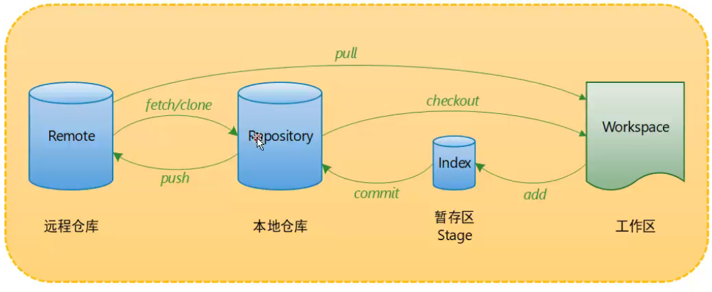
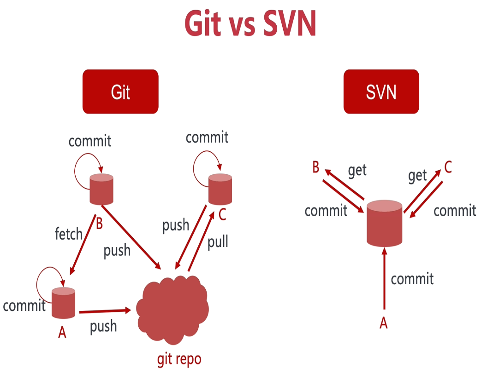
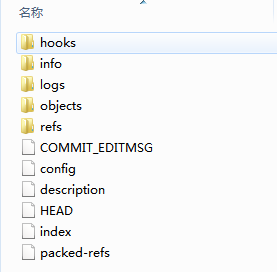
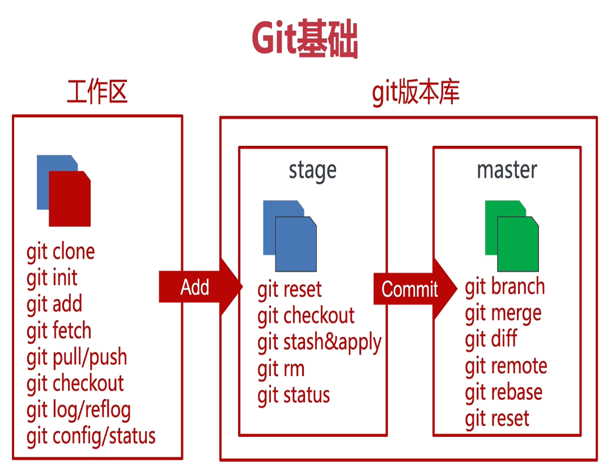

::: tip Git

版本控制工具

:::


## Git基础

### 一、Git简介

- Git是目前世界上最先进的分布式版本控制系统，在处理各种项目时都十分高效，而且非常的高大上。
- Git的工作原理 / 流程：
   - 
   - Workspace：工作区
   - Index / Stage：暂存区
   - Repository：仓库区（或本地仓库）
   - Remote：远程仓库
- SVN与Git的最主要的区别？
   - SVN与Git都是版本控制系统
      - SVN是集中式版本控制系统，版本库是集中放在中央服务器的，而干活的时候，用的都是自己的电脑，所以首先要从中央服务器获得到最新的版本，然后干活，干完后，需要把自己做完的活推送到中央服务器。而且集中式版本控制系统是必须联网才能工作。
         - 
         - **优点**：简单，易学习，易操作，很多时候，只需要点点鼠标就完成了工作
         - **缺点**：需要一台中央服务器来管理代码版本和备份，如果连不上中央服务器，就无法获取或上传代码简单，易学习，易操作，很多时候，只需要点点鼠标就完成了工作
      - Git是分布式版本控制系统，它就没有中央服务器的，每个人的电脑就是一个完整的版本库，这样，工作的时候就不需要联网了，因为版本都是在自己的电脑上。既然每个人的电脑都有一个完整的版本库，那多个人如何协作呢？比如说自己在电脑上改了文件A，其他人也在电脑上改了文件A，这时，你们两之间只需把各自的修改推送给对方，就可以互相看到对方的修改了。
         - 
   - 
- 版本格式
   - 

### 二、Git安装

#### 在Windows系统下的安装过程

- 打开[Git官网](https://git-for-windows.github.io/ )下载安装程序，然后按照默认选项安装即可。
- 安装完成后，打开Git bash软件，弹出一个类似cmd的命令行窗口，证明安装成功。


- 安装完成后，需要进行Git 全局配置


### 三、常用Git命令介绍

#### 命令行介绍

1. #### 首先在Git安装后需要进行全局配置

   1. 配置用户信息

      - ```csharp
         $ git config --global user.name "Your Name 用户名"
                  
         $ git config --global user.email "abc@example.com 邮箱地址"
         ```

   1. 查看用户信息

      - ```bash
         $ git config user.name
         
         $ git config user.email
         ```
      
   3. > 假如我们这时候报错，证明Git的用户名和密码没有配置成功，我们还可以这样做：
      >
      > - 在用户主目录下找到 .git 文件夹
      > - 
      > - 打开 config 文件，这是专门用来配置和读取相应的工作环境变量的，在里面加上如图所示内容：
      > - 或者windows7下，用户主目录下找到.gitconfig 文件，修改name和email
      > - 完成了对Git用户名和邮箱的配置
      
   4. 配置行为

      - 

   

2. #### 创建版本库

   - 版本库(repository)也叫仓库，可以看做一个目录，这个目录里的所有文件都由Git进行管理，每个文件的修改、删除，Git都能跟踪。

   1. 将本地目录转换为一个仓库

      1. 选择一个合适的地方，创建一个空目录（如果已经准备好目标目录则跳过）

         - ~~~bash
            $ mkdir learngit     //创建一个名叫learngit的空目录
            $ cd learngit        //把learngit设置为当前目录
            $ pwd                //查看当前目录
            /c/Users/Administrator/learngit
            ~~~

         - > 如果使用Windows系统，要保证目录名不包含中文
         
      2. 将已存在的目录变成Git可以管理的仓库

         - ~~~bash
            $ git init
            Initialized empty Git repository in /Users/Administrator/learngit/.git/
            ~~~

         - > 这样Git就把仓库建好啦，我们可以看到在当前目录下多了一个 .git 的目录，这个目录是Git来跟踪管理版本库的。

      3. 新建文件并添加到版本库

         - > ~~~bash
           > $ touch README.md       //在 learngit 目录下编写一个 Readme.md 文件
           > ~~~
           >
           > README.md写入两行
           >
           > > Git is a version control system.
           > >
           > > Git is free software.
           >
           > ~~~bash
           > $ git add README.md           //git add命令，把文件添加到临时仓库
           > $ git commit -m "add README"  //git commit 命令，把文件提交到仓库
           > 
           > 1 file changed, 2 insertions(+) //1 file changed：1个文件被改动（新添加的readme.txt文件）；2 insertions：插入了两行内容（readme.txt内有两行内容）
           > create mode 100644 readme.txt
           > ~~~

   2. 本地文件内容的修改、添加和提交仓库

      - > 之前已经成功添加并提交了一个 README.md  文件
        >
        > 继续修改 README.md  文件，改成如下内容：
        >
        > > Git is a distributed version control system.
        > >
        > > Git is free software.
        >
        > ~~~bash
        > $ git status          //git status 命令，查看仓库当前的状态
        > On branch master
        > Changes not staged for commit: //没有文件将要被提交
        > (use "git add <file>..." to update what will be committed)
        > (use "git checkout -- <file>..." to discard changes in working directory)
        > modified:   README.md 
        > no changes added to commit (use "git add" and/or "git commit -a")
        > ~~~
        >
        > 上面的命令反馈告诉我们，README.md 文件被修改过了，但还没有准备提交的修改。
        >
        > 此时提供两种方案进行后续操作
        >
        > 1. `git add <file>...`添加到暂存区
        > 1. `git checkout -- <file>...`恢复到修改之前

      - 此时遇到问题：忘记了修改了什么内容，或者别人修改的，自己不知道应该进行保留添加到暂存区还是删除恢复到修改之前的状态？

      - 需要用 `git diff` 命令获取readme.txt 文件怎么修改的

      - ~~~bash
         $ git diff readme.txt 
         diff --git a/readme.txt b/readme.txt
         index 46d49bf..9247db6 100644
         --- a/readme.txt   //版本仓库的
         +++ b/readme.txt   //工作区的
         @@ -1,2 +1,2 @@
         -Git is a version control system. //这一句是被删掉的
         +Git is a distributed version control system. //这一句是新添加的
         Git is free software.
         

         //比较不同版本的差异
         $ git diff "HEAD^" HEAD         
         $ git diff head@{1} head@{0} 
         ~~~
         
      - > 对修改的文件进行添加`git add`与提交`git commit`
         >
         > ~~~bash
         > $ git add readme.txt               //把文件添加到临时仓库
         > $ git status                       //查看一下当前仓库状态
         > On branch master
         > Changes to be committed:           //将要被提交的文件包括 readme.txt
         > (use "git reset HEAD <file>..." to unstage)
         > modified:   readme.txt
         > 
         > $ git commit -m "add distributed"  //把文件提交到仓库,并添加备注说明
         > [master e475afc] add distributed
         > 1 file changed, 1 insertion(+), 1 deletion(-)
         > 
         > $ git status                       //查看一下当前仓库状态
         > On branch master
         > nothing to commit, working tree clean //当前没有需要提交的修改，而且，工作目录是干净的。  
         > ~~~

   3. 忽略文件

      - > 1. 第一步   git命令行中进入本地仓库
        > 1. 第二步   输入 touch .gitignore (会生成.gitignore文件)
        > 1. 第三步  编辑.gitignore文件：
        >
        > > 过滤文件夹设置：
        > >
        > > /public/
        > >
        > > /static/upload/
        > >
        > > /.idea/
        > >
        > > 过滤文件设置： 
        > >
        > > *.sh
        > >
        > > public/do.c

3. #### 版本回退

      1. > 如果我们继续对 readme.txt 文件进行修改，改成如下内容
         >
         > > Git is a distributed version     control system.
         > >
         > > Git is free software distributed under the GPL
         >
         > 添加并提交
         >
         > ~~~bash
         > $ git add readme.txt
         > $ git commit -m "append GPL"
         > [master 1094adb] append GPL
         > 1 file changed, 1 insertion(+), 1 deletion(-)
         > ~~~

      2. 到目前为止，readme.txt 文件一共有三个版本被提交到了 Git 仓库里

          - 用 `git log` 命令查看提交日志

          - ~~~bash
             $ git log //查看历史记录（commit 的版本日志 包含提交的版本 操作者 日期）

             commit 1094adb7b9b3807259d8cb349e7df1d4d6477073 (HEAD -> master)
             Author: Michael Liao <askxuefeng@gmail.com>
             Date:   Fri May 18 21:06:15 2018 +0800
             append GPL

             commit e475afc93c209a690c39c13a46716e8fa000c366
             Author: Michael Liao <askxuefeng@gmail.com>
             Date:   Fri May 18 21:03:36 2018 +0800
             add distributed

             commit eaadf4e385e865d25c48e7ca9c8395c3f7dfaef0
             Author: Michael Liao <askxuefeng@gmail.com>
             Date:   Fri May 18 20:59:18 2018 +0800
             wrote a readme file
             ~~~

          - > 还可以加上 --pretty=oneline 参数
             >
             > 一大串数字是 commit id ，而且每个人的都不一样。

          - ~~~bash
             $ git log --pretty=oneline
             1094adb7b9b3807259d8cb349e7df1d4d6477073 (HEAD -> master) append GPL
             e475afc93c209a690c39c13a46716e8fa000c366 add distributed
             eaadf4e385e865d25c48e7ca9c8395c3f7dfaef0 wrote a readme file 
             ~~~
      
          - `git log origin/master`查看远程仓库的提交日志

          - 更强大的 `git reflog` 命令查看命令操作历史
      
          - ~~~
              $ git reflog   //查找到所有分支的所有操作记录，包括删除的以及reset的内容
          bacf721 HEAD@{0}: commit: append GPL
              535537e HEAD@{1}: commit: :bento: 更新资源文件
              521014e HEAD@{2}: commit: add distributed
            ~~~

          - 
      
      3. 现在如果我们想把 readme.txt 文件退回到上一个版本，就可以使用 `git reset` 命令
      
    - ~~~bash
             $ git reset --hard HEAD^ 
       HEAD is now at e475afc add distributed
       ~~~

          - > HEAD表示当前版本，则HEAD^ 表示上一个版本，那么上上版本就是HEAD^^
       >
             > ~~~bash
       > //比较不同版本的差异
             > $ git diff "HEAD^" HEAD         
             > $ git diff head@{1} head@{0} 
             > ~~~
       >
             > 

      4. 现在想要回到最新的版本，还是使用 `git reset` 命令

          - ~~~bash
       $ git reset --hard 1094a
             HEAD is now at 83b0afe append GPL
             ~~~
      
    - >  这里不能用HEAD而必须使用 commit id ，因为最新版本在之前返回时已经被删除了，1094a就是最新版本的 commit id，可以在之前的代码中查到
      
          - 
      
      5. `git reset`使用图示
      
          - 
      
          - 其中：A 和 B 是正常提交，而 C 和 D 是错误提交。现在，我们想把 C 和 D 回退掉。而此时，HEAD 指针指向 D 提交（5lk4er）。我们只需将 HEAD 指针移动到 B 提交（a0fvf8），就可以达到目的。
      
          - ~~~bash
             $ git reset --hard a0fvf8
             ~~~
      
          - 命令运行之后，HEAD 指针就会移动到 B 提交下
      
          - 
      
          - 而这个时候，远程仓库的 HEAD 指针依然不变，仍在 D 提交上。所以，如果直接使用`git push`命令的话，将无法将更改推到远程仓库。此时，只能使用`-f` 选项将提交强制推到远程仓库：
      
          - ~~~bash
             $ git push -f
             ~~~
      
      6. `git revert`


### 四、工作区和暂存区

- 工作区（Working Directory）
   - learngit 文件夹就是一个工作区。
- 版本库（Repository）
   - 工作区有个隐藏目录 .git ，这个不算工作区，而是 Git 的版本库。
   - 版本库里面的 index(stage) 文件叫暂存区，还有Git为我们自动创建的第一个分支 master ，以及指向 master 的一个指针叫做 HEAD。
- 
- 
- 前面我们提到过，如果我们想把文件添加到Git里面时，需要分两步：
   - 
   - 第一步是用 git add 把文件添加进去，实际上就是把文件修改添加到暂存区。
      - 
   - 第二步是用 git commit 提交更改，实际上就是把暂存区的所有内容提交到当前分支。（我们现在只有唯一一个分支 master，所以现在就是往 master 分支上提交更改）
      - 
   - 


### 附件





### 五、远程仓库准备工作

#### 常用远程仓库

~~~mermaid
graph LR
A(git repo) --> B1(gitlab)
A --> B2(gitea)
A --> B3(github)
A --> B4(gitee)
~~~

#### 远程交互


#### Github

创建一个Github远程仓库

仓库分公开和私有的，公开的是免费的，私有的是收费的

1. 在了解之前，先注册github账号，由于你的本地Git仓库和github仓库之间的传输是通过SSH加密的，所以需要一点设置：

   1. 第一步：创建SSH Key。在用户主目录下，看看有没有.ssh目录，如果有，再看看这个目录下有没有id_rsa和id_rsa.pub这两个文件，如果有的话，直接跳过此如下命令，如果没有的话，打开命令行，输入如下命令：
      - ssh-keygen -t rsa –C “youremail@example.com”, 
   2. 第二步：登录github,打开” settings”中的SSH Keys页面，然后点击“Add SSH Key”,填上任意title，在Key文本框里黏贴id_rsa.pub文件的内容。

2. 在github创建远程仓库repository

   - 

   - 

   - > - 如图所示填写好repository name、Description，默认选择Public，可以选择复选框Initialize this repository with a README，选择吧，点击Create repository就可以创建好用于保存网站的repository。
      > - 这个repository name没有要求，随便起，不像github的pages服务要求名字和github的账号名称一样，建议起名domainname.com，当你有多个网站要管理的话，这样就可以一眼就可以看出是那个网站了，我自己当时就不知道可以用点，所以也不知道这样来起名字。

3. `git clone git@host:path`本地无仓库，将远程仓库抓取下来，进行远程交互

   - > 从网络仓库抓取下来
     >
     > `git clone [url]`                     下载一个项目和它的整个代码历史
     >
     > ~~~bash
     > $ git clone http://git.zju.cc/practice/git-exmple.git
     > cd git-exmple
     > ~~~
     >
     > 修改本地文件后，提交
     >
     > ~~~bash
     > $ git add -A
     > $ git commit -m “这里写下你自己的记录本次提交内容的信息
     > ~~~
     >
     > > - git add -A  提交所有变化
     > > - git add -u  提交被修改(modified)和被删除(deleted)文件，不包括新文件(new)
     > > - git add .  提交新文件(new)和被修改(modified)文件，不包括被删除(deleted)文件
     >
     > 把当前分支master推送到远程仓库上去
     >
     > ~~~bash
     > $ git remote add origin-GitUserBook http://git.zju.cc/practice/git-exmple.git
     > $ git push origin-GitUserBook master
     > ~~~
     >
     > origin-GitUserBook 替代 origin作为新的仓库名，以防在提交多个仓库时候和之前的origin仓库重了。
     >
     > > 由于远程库是空的，我们第一次推送master分支时，加上了-u参数，这样设置默认值后，每次只要`git push`即可
     > >
     > > git push -u origin master
     
   - `git push`

      - ~~~bash
         $ git push [-u] <remote repository> <local branch>:<remote branch>
         ~~~

      - 

4. `git init` 和  `remote add`本地已新建仓库，与远程仓库进行关联，进行交互

   - ~~~bash
      $ git remote add [remote name] [url]
      即：
      $ git remote add origin关联远程仓库地址的代号 git@host:path
      ~~~

   - > url支持http协议和shh协议

5. 本地自动化

   - > bash文件
     >
     > ~~~bash
     > #!/usr/bin/env sh
     > 
     > echo 开始更新资源
     > 
     > # 提交到暂存区
     > git add -A
     > 
     > # 提交到本地仓库
     > git commit -m ':bento: 更新资源文件'
     > 
     > # git添加远程仓库地址到origin名称，建立关联
     > git remote add origin-GitUserBook https://github.com/weihuohuayi/GithubUserbook.git
     > 
     > # push将本地master分支推送到github仓库——origin-GitUserBook 的主要分支——master分支
     > git push origin-GitUserBook master
     > 
     > echo 更新资源推送完毕
     > ~~~
   - > .gitignore文件
      >
      > ~~~txt
      > .sh/
      > ~~~

---


## 推荐书籍

- 《pro.git中文版》


## 推荐连接

 [git 学习网站，依据你提交的信息，实时展示当前的分支情况](https://learngitbranching.js.org/)

<div>
    <a target="_blank" href="https://learngitbranching.js.org/" data-draft-node="block"
  data-draft-type="link-card" data-image="https://pic2.zhimg.com/v2-f63c28a54be0362584d3ecad72417ae9_ipico.jpg"
  data-image-width="2048" data-image-height="2048" class="LinkCard LinkCard--hasImage" data-za-detail-view-id="172">
    <span class="LinkCard-backdrop"
    style="background-image:url(https://pic2.zhimg.com/v2-f63c28a54be0362584d3ecad72417ae9_ipico.jpg)">
  </span>
    <span class="LinkCard-content"><span class="LinkCard-text"><span class="LinkCard-title" data-text="true">Learn Git Branching</span><span class="LinkCard-meta"><span style="display:inline-flex;align-items:center">​<svg class="Zi Zi--InsertLink" fill="currentColor" viewBox="0 0 24 24" width="17" height="17"><path d="M13.414 4.222a4.5 4.5 0 1 1 6.364 6.364l-3.005 3.005a.5.5 0 0 1-.707 0l-.707-.707a.5.5 0 0 1 0-.707l3.005-3.005a2.5 2.5 0 1 0-3.536-3.536l-3.005 3.005a.5.5 0 0 1-.707 0l-.707-.707a.5.5 0 0 1 0-.707l3.005-3.005zm-6.187 6.187a.5.5 0 0 1 .638-.058l.07.058.706.707a.5.5 0 0 1 .058.638l-.058.07-3.005 3.004a2.5 2.5 0 0 0 3.405 3.658l.13-.122 3.006-3.005a.5.5 0 0 1 .638-.058l.069.058.707.707a.5.5 0 0 1 .058.638l-.058.069-3.005 3.005a4.5 4.5 0 0 1-6.524-6.196l.16-.168 3.005-3.005zm8.132-3.182a.25.25 0 0 1 .353 0l1.061 1.06a.25.25 0 0 1 0 .354l-8.132 8.132a.25.25 0 0 1-.353 0l-1.061-1.06a.25.25 0 0 1 0-.354l8.132-8.132z"></path></svg></span>learngitbranching.js.org</span></span><span class="LinkCard-imageCell"></span></span>
    </a>
</div>


<div>
    <video class="_1k7bcr7" preload="metadata" playsinline="" webkit-playsinline="" x-webkit-airplay="deny" src="https://vdn1.vzuu.com/SD/e8c7e5dc-6c3e-11ea-87d6-82c305a5f28d.mp4?disable_local_cache=1&amp;bu=http-com&amp;expiration=1598202560&amp;auth_key=1598202560-0-0-f2bb2e4bab5e7241e2fa3c08f46a2508&amp;f=mp4&amp;v=hw" style="object-fit: contain;"></video>
</div>

