## Git学习笔记

### 一、Git简介

- Git是目前世界上最先进的分布式版本控制系统，在处理各种项目时都十分高效，而且非常的高大上。
- Git的工作原理 / 流程：
   - 
   - Workspace：工作区
   - Index / Stage：暂存区
   - Repository：仓库区（或本地仓库）
   - Remote：远程仓库
- SVN与Git的最主要的区别？
   - SVN与Git都是版本控制系统
      - SVN是集中式版本控制系统，版本库是集中放在中央服务器的，而干活的时候，用的都是自己的电脑，所以首先要从中央服务器获得到最新的版本，然后干活，干完后，需要把自己做完的活推送到中央服务器。而且集中式版本控制系统是必须联网才能工作。
      - Git是分布式版本控制系统，它就没有中央服务器的，每个人的电脑就是一个完整的版本库，这样，工作的时候就不需要联网了，因为版本都是在自己的电脑上。既然每个人的电脑都有一个完整的版本库，那多个人如何协作呢？比如说自己在电脑上改了文件A，其他人也在电脑上改了文件A，这时，你们两之间只需把各自的修改推送给对方，就可以互相看到对方的修改了。
      - 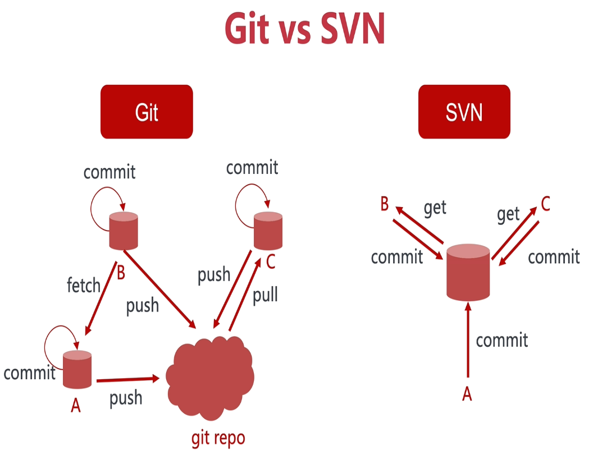
- 版本格式
   - 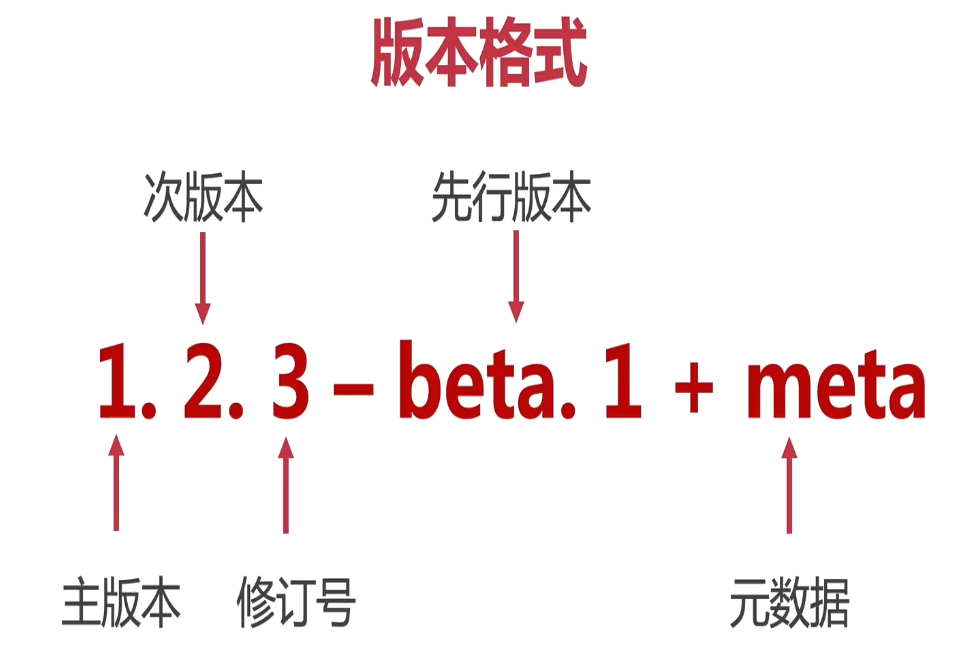

### 二、Git安装

#### 在Windows系统下的安装过程

- 打开[Git官网](https://git-for-windows.github.io/ )下载安装程序，然后按照默认选项安装即可。
- 安装完成后，打开Git bash软件，弹出一个类似cmd的命令行窗口，证明安装成功。

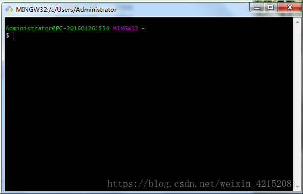

- 安装完成后，需要进行Git 全局配置


### 三、常用Git命令介绍

#### 命令行介绍

1. #### 首先在Git安装后需要进行全局配置

   1. 配置用户信息

      - ```csharp
         $ git config --global user.name "Your Name 用户名"
                  
         $ git config --global user.email "abc@example.com 邮箱地址"
         ```

   1. 查看用户信息

      - ```bash
         $ git config user.name
         
         $ git config user.email
         ```
      
   3. > 假如我们这时候报错，证明Git的用户名和密码没有配置成功，我们还可以这样做：
      >
      > - 在用户主目录下找到 .git 文件夹
      > - 
      > - 打开 config 文件，这是专门用来配置和读取相应的工作环境变量的，在里面加上如图所示内容：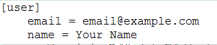
      > - 或者windows7下，用户主目录下找到.gitconfig 文件，修改name和email
      > - 完成了对Git用户名和邮箱的配置

   

2. #### 创建版本库

   - 版本库(repository)也叫仓库，可以看做一个目录，这个目录里的所有文件都由Git进行管理，每个文件的修改、删除，Git都能跟踪。

   1. 将本地目录转换为一个仓库

      1. 选择一个合适的地方，创建一个空目录（如果已经准备好目标目录则跳过）

         - ~~~bash
            $ mkdir learngit     //创建一个名叫learngit的空目录
            $ cd learngit        //把learngit设置为当前目录
            $ pwd                //查看当前目录
            /c/Users/Administrator/learngit
            ~~~

         - > 如果使用Windows系统，要保证目录名不包含中文
         
      2. 将已存在的目录变成Git可以管理的仓库

         - ~~~bash
            $ git init
            Initialized empty Git repository in /Users/Administrator/learngit/.git/
            ~~~

         - > 这样Git就把仓库建好啦，我们可以看到在当前目录下多了一个 .git 的目录，这个目录是Git来跟踪管理版本库的。

      3. 新建文件并添加到版本库

         - > ~~~bash
           > $ touch README.md       //在 learngit 目录下编写一个 Readme.md 文件
           > ~~~
           >
           > README.md写入两行
           >
           > > Git is a version control system.
           > >
           > > Git is free software.
           >
           > ~~~bash
           > $ git add README.md           //git add命令，把文件添加到临时仓库
           > $ git commit -m "add README"  //git commit 命令，把文件提交到仓库
           > 
           > 1 file changed, 2 insertions(+) //1 file changed：1个文件被改动（新添加的readme.txt文件）；2 insertions：插入了两行内容（readme.txt内有两行内容）
           > create mode 100644 readme.txt
           > ~~~

   2. 本地文件内容的修改、添加和提交仓库

      - > 之前已经成功添加并提交了一个 README.md  文件
        >
        > 继续修改 README.md  文件，改成如下内容：
        >
        > > Git is a distributed version control system.
        > >
        > > Git is free software.
        >
        > ~~~bash
        > $ git status          //git status 命令，查看仓库当前的状态
        > On branch master
        > Changes not staged for commit: //没有文件将要被提交
        > (use "git add <file>..." to update what will be committed)
        > (use "git checkout -- <file>..." to discard changes in working directory)
        > modified:   README.md 
        > no changes added to commit (use "git add" and/or "git commit -a")
        > ~~~
        >
        > 上面的命令反馈告诉我们，README.md 文件被修改过了，但还没有准备提交的修改。
        
      - 如果我们想知道上次是怎么修改readme.txt 文件的，需要用 `git diff` 命令
      
      - ~~~bash
         $ git diff readme.txt 
         diff --git a/readme.txt b/readme.txt
         index 46d49bf..9247db6 100644
         --- a/readme.txt
         +++ b/readme.txt
         @@ -1,2 +1,2 @@
         -Git is a version control system. //这一句是被删掉的
         +Git is a distributed version control system. //这一句是新添加的
         Git is free software.
         ~~~
      
      - > 对修改的文件进行添加`git add`与提交`git commit`
         >
         > ~~~bash
         > $ git add readme.txt               //把文件添加到临时仓库
         > $ git status                       //查看一下当前仓库状态
         > On branch master
         > Changes to be committed:           //将要被提交的文件包括 readme.txt
         > (use "git reset HEAD <file>..." to unstage)
         > modified:   readme.txt
         > 
         > $ git commit -m "add distributed"  //把文件提交到仓库,并添加备注说明
         > [master e475afc] add distributed
         > 1 file changed, 1 insertion(+), 1 deletion(-)
         > 
         > $ git status                       //查看一下当前仓库状态
         > On branch master
         > nothing to commit, working tree clean //当前没有需要提交的修改，而且，工作目录是干净的。  
         > ~~~

3. #### 版本回退

      1. > 如果我们继续对 readme.txt 文件进行修改，改成如下内容
         >
         > > Git is a distributed version     control system.
         > >
         > > Git is free software distributed under the GPL
         >
         > 添加并提交
         >
         > ~~~bash
         > $ git add readme.txt
         > $ git commit -m "append GPL"
         > [master 1094adb] append GPL
         > 1 file changed, 1 insertion(+), 1 deletion(-)
         > ~~~

      2. 到目前为止，readme.txt 文件一共有三个版本被提交到了 Git 仓库里

          - 用 git log 命令进行查看

          - ~~~bash
             $ git log //查看历史记录

             commit 1094adb7b9b3807259d8cb349e7df1d4d6477073 (HEAD -> master)
             Author: Michael Liao <askxuefeng@gmail.com>
             Date:   Fri May 18 21:06:15 2018 +0800
             append GPL

             commit e475afc93c209a690c39c13a46716e8fa000c366
             Author: Michael Liao <askxuefeng@gmail.com>
             Date:   Fri May 18 21:03:36 2018 +0800
             add distributed

             commit eaadf4e385e865d25c48e7ca9c8395c3f7dfaef0
             Author: Michael Liao <askxuefeng@gmail.com>
             Date:   Fri May 18 20:59:18 2018 +0800
             wrote a readme file
             ~~~

          - > 还可以加上 --pretty=oneline 参数
             >
             > 一大串数字是 commit id ，而且每个人的都不一样。

          - ~~~bash
             $ git log --pretty=oneline
             1094adb7b9b3807259d8cb349e7df1d4d6477073 (HEAD -> master) append GPL
             e475afc93c209a690c39c13a46716e8fa000c366 add distributed
             eaadf4e385e865d25c48e7ca9c8395c3f7dfaef0 wrote a readme file 
             ~~~

      1. 现在如果我们想把 readme.txt 文件退回到上一个版本，就可以使用 git reset 命令

          - ~~~bash
             $ git reset --hard HEAD^ 
             HEAD is now at e475afc add distributed
             ~~~

          - > HEAD表示当前版本，则HEAD^ 表示上一个版本，那么上上版本就是HEAD^^
          
      4. 现在想要回到最新的版本，还是使用 git reset 命令

          - ~~~bash
             $ git reset --hard 1094a
             HEAD is now at 83b0afe append GPL
             ~~~

          - >  这里不能用HEAD而必须使用 commit id ，因为最新版本在之前返回时已经被删除了，1094a就是最新版本的 commit id，可以在之前的代码中查到

          - 


### 四、工作区和暂存区

- 工作区（Working Directory）
   - learngit 文件夹就是一个工作区。
- 版本库（Repository）
   - 工作区有个隐藏目录 .git ，这个不算工作区，而是 Git 的版本库。
   - 版本库里面的 index(stage) 文件叫暂存区，还有Git为我们自动创建的第一个分支 master ，以及指向 master 的一个指针叫做 HEAD。
- 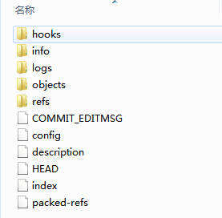
- 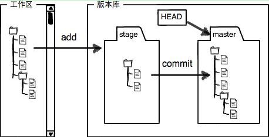
- 前面我们提到过，如果我们想把文件添加到Git里面时，需要分两步：
   - 第一步是用 git add 把文件添加进去，实际上就是把文件修改添加到暂存区。
      - 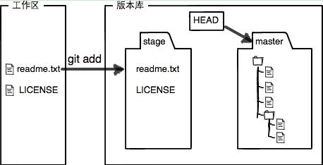
   - 第二步是用 git commit 提交更改，实际上就是把暂存区的所有内容提交到当前分支。（我们现在只有唯一一个分支 master，所以现在就是往 master 分支上提交更改）
      - 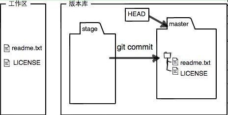


### 附件

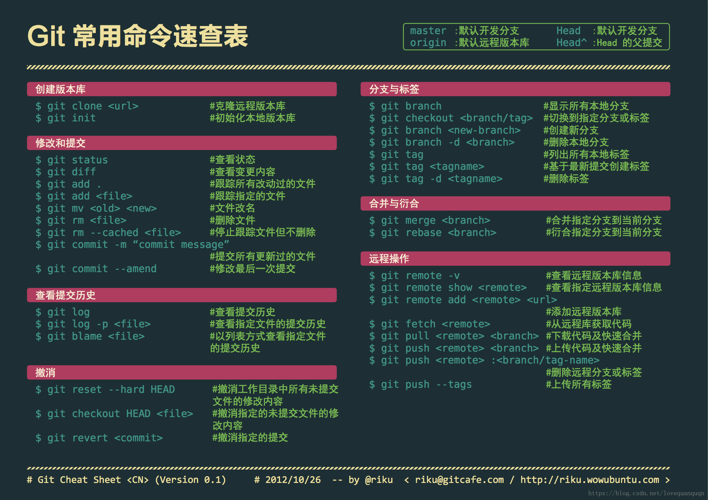

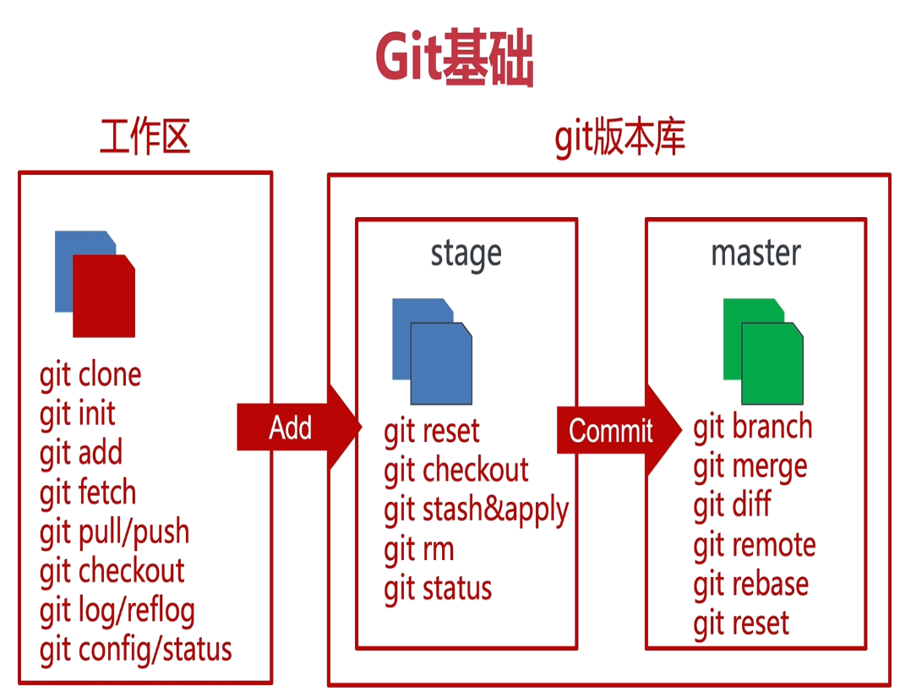


### 五、远程仓库准备工作

#### 常用远程仓库

~~~mermaid
graph LR
A(git repo) --> B1(gitlab)
A --> B2(gitea)
A --> B3(github)
A --> B4(gitee)
~~~


#### Github

创建一个Github远程仓库

仓库分公开和私有的，公开的是免费的，私有的是收费的

1. 创建仓库repository

   - 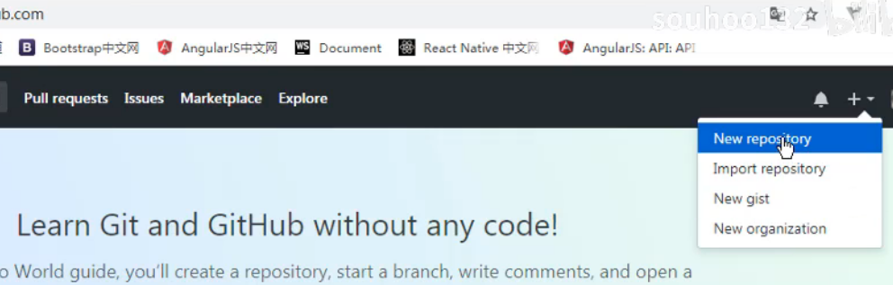

   - 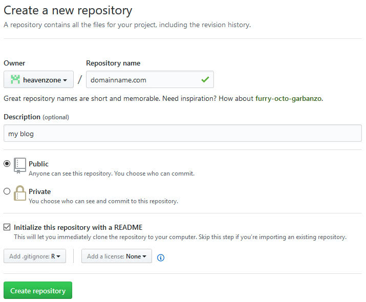

   - > - 如图所示填写好repository name、Description，默认选择Public，可以选择复选框Initialize this repository with a README，选择吧，点击Create repository就可以创建好用于保存网站的repository。
      > - 这个repository name没有要求，随便起，不像github的pages服务要求名字和github的账号名称一样，建议起名domainname.com，当你有多个网站要管理的话，这样就可以一眼就可以看出是那个网站了，我自己当时就不知道可以用点，所以也不知道这样来起名字。


 

四、创建成功后，界面如下，可以点击README.md来编译这个文件 

1. 创建一个新仓库（本地）

   - 从网络仓库抓取下来

   - ```bash
      $ git clone http://git.dayuan.cc/practice/git-exmple.git
      cd git-exmple
      $ touch README.md
      $ git add README.md
      $ git commit -m "add README"
      $ git push -u origin master
      ```

2. 在已存在的目录中创建仓库

   - ```csharp
      cd existing_folder
      $ git init
      $ git remote add origin http://git.dayuan.cc/practice/git-exmple.git
      $ git add .
      $ git commit -m "Initial commit"
      $ git push -u origin master
      ```

3. 将本地已存在的仓库推送到远程仓库

   - ```csharp
      cd existing_repo
      $ git remote rename origin old-origin
      $ git remote add origin http://git.dayuan.cc/practice/git-exmple.git
      $ git push -u origin --all
      $ git push -u origin --tags
      ```

4. 查看分支相关命令

   - ```ruby
      $ git branch -r; //查看远程分支
      $ git branch; //查看本地分支
      $ git branch -a; //查看所有分支
      ```

5. 拉取远程分支并创建本地分支

6. 

   


## Git Flow开发


## 分支的合并


### 场景：基于master分支的代码，开发一个新的特性

如果你直接在master分支上开发这个新特性，是不好的，万一你在开发`特性1`的时候，领导突然又要叫你去开发`特性2`，就不好处理了。难道开发的两个特性都提交到master？一会儿提交特性1的commit，一会儿提交特性2的commit？这会导致commit记录很混乱。

所以，我给你的建议做法是：给每个特性都单独建一个的新的分支。

比如说，我专门给`特性1`建一个分支`feature_item_recommend`。具体做法如下：

（1）基于master分支，创建一个新的分支，起名为`feature_item_recommend`：

```
$ git checkout -b feature_item_recommend

Switched to a new branch 'feature_item_recommend'
```

上面这行命令，相当于：


```bash
$ git branch feature_item_recommend    // 创建新的分支

$ git checkout feature_item_recommend  //切换到新的分支
```


（2）在新的分支`feature_item_recommend`上，完成开发工作，并 commit 、push。

（3）将分支`feature_item_recommend`上的开发进度**合并**到master分支：

```bash
$ git checkout master  //切换到master分支

$ git merge feature_item_recommend    //将分支 feature_item_recommend 的开发进度合并到 master 分支

```


合并之后，`master`分支和`feature_item_recommend`分支会指向同一个位置。


（3）删除分支`feature_item_recommend`：

> 既然 特性1 开发完了，也放心地提交到master了，那我们就可以将这个分支删除了。

```
git branch -d feature_item_recommend
```

注意，我们当前是处于`master`分支的位置，来删除`feature_item_recommend`分支。如果当前是处于`feature_item_recommend`分支，是没办法删除它自己的。

同理，当我转身去开发`特性2`的时候，也是采用同样的步骤。


### 合并分支时，如果存在分叉


比如说上面这张图中，最早的时候，master分支是位于`C2`节点。我基于`C2`节点，new出一个新的分支`iss53`，我在`iss53`上提交了好几个commit。

现在，我准备把`iss53`上的几个commit合并到master上，此时发现，master分支已经前进到C4了。那该怎么合并呢？

合并的命令仍然是：

```bash
$ git checkout master

$ git merge iss53
```

**解释**：

这次合并的实现，并不同于简单的并入方式。这一次，我的开发历史是从更早的地方开始分叉的。

由于当前 master 分支所指向的commit (C4)并非想要并入分支（iss53）的直接祖先，Git 不得不进行一些处理。就此例而言，Git 会用两个分支的末端（C4 和C5）和它们的共同祖先（C2）进行一次简单的三方合并计算。

Git 没有简单地把分支指针右移，而是对三方合并的结果作一新的快照，并自动创建一个指向它的commit（C6）（如下图所示）。我们把这个特殊的commit 称作合并提交（mergecommit），因为它的祖先不止一个。

值得一提的是Git 可以自己裁决哪个共同祖先才是最佳合并基础；这和CVS 或Subversion（1.5 以后的版本）不同，它们需要开发者手工指定合并基础。所以此特性让Git 的合并操作比其他系统都要简单不少。


### 解决合并时发生的冲突


如果 feature1和feature2修改的是同一个文件中**代码的同一个位置**，那么，把feature1合并到feature2时，就会产生冲突。这个冲突需要人工解决。步骤如下：

（1）手动修改文件：手动修改冲突的那个文件，决定到底要用哪个分支的代码。

（2）git add：解决好冲突后，输入`git status`，会提示`Unmerged paths`。这个时候，输入`git add`即可，表示：**修改冲突成功，加入暂存区**。

（3）git commit 提交。

然后，我们可以继续把 feature1 分支合并到 master分支，最后删除feature1、feature2。

**注意**：两个分支的同一个文件的不同地方合并时，git会自动合并，不会产生冲突。

比如分支feture1对index.html原来的第二行之前加入了一段代码。
分支feature2对index.html在原来的最后一行的后面加入了一段代码。
这个时候在对两个分支合并，git不会产生冲突，因为两个分支是修改同一文件的不同位置。
git自动合并成功。不管是git自动合并成功，还是在人工解决冲突下合并成功，提交之前，都要对代码进行测试。

## 日常操作积累

### 修改密码（曲线救国）


> 网上查了很久，没找到答案。最终，在cld童鞋的提示下，采取如下方式进行曲线救国。

```bash
# 设置当前仓库的用户名为空
git config  user.name ""
```


然后，当我们再输入`git pull`等命令行时，就会被要求重新输入*新的*账号密码。此时，密码就可以修改成功了。最后，我们还要输入如下命令，还原当前仓库的用户名：

```
git config user.name "smyhvae"
```


### 修改已经push的某次commit的作者信息

已经push的记录，如果要修改作者信息的话，只能 通过--force命令。我反正是查了很久，但最终还是不敢用公司的仓库尝试。

参考链接：


- [git 修改已提交的某一次的邮箱和用户信息](https://segmentfault.com/q/1010000006999861)

看最后一条答案。

- [修改 git repo 历史提交的 author](http://baurine.github.io/2015/08/22/git_update_author.html)


### 将 `branch1`的某个`commit1`合并到`branch2`当中

切换到branch2中，然后执行如下命令：

```
git cherry-pick commit1
```


### 20190118-修改GitHub已提交的用户名和邮箱

参考链接：（亲测有效）

- [修改Git全部Commit提交记录的用户名Name和邮箱Email](https://cloud.tencent.com/developer/article/1352623)

- [Mac 运行sh文件，也就是传说中的shell脚本](https://blog.csdn.net/yusufolu9/article/details/53706269)


## git客户端推荐

市面上的Git客户端我基本都用过了，我最推荐的一款Git客户端是：[Tower](https://www.git-tower.com) 或者 [Fork](https://git-fork.com)。

- GitUp：<https://gitup.co/>

20180623时，网上看了下Git客户端的推荐排名：


**SmartGit**：

商业用途收费， 个人用户免费：
s


## 推荐书籍

- 《pro.git中文版》


## 推荐连接


### 2018-06

- [聊下git pull --rebase](https://www.cnblogs.com/wangiqngpei557/p/6056624.html)


