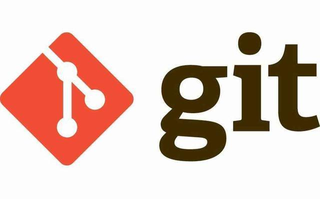
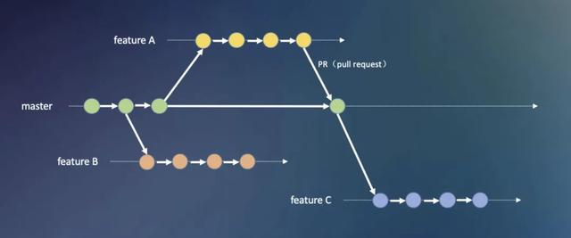
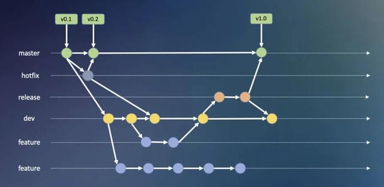

::: tip Git

版本控制工具

:::


## Git基础

### 一、Git简介

- Git是目前世界上最先进的分布式版本控制系统，在处理各种项目时都十分高效，而且非常的高大上。
- Git的工作原理 / 流程：
   - 
   - Workspace：工作区
   - Index / Stage：暂存区
   - Repository：仓库区（或本地仓库）
   - Remote：远程仓库
- SVN与Git的最主要的区别？
   - SVN与Git都是版本控制系统
      - SVN是集中式版本控制系统，版本库是集中放在中央服务器的，而干活的时候，用的都是自己的电脑，所以首先要从中央服务器获得到最新的版本，然后干活，干完后，需要把自己做完的活推送到中央服务器。而且集中式版本控制系统是必须联网才能工作。
         - 
         - **优点**：简单，易学习，易操作，很多时候，只需要点点鼠标就完成了工作
         - **缺点**：需要一台中央服务器来管理代码版本和备份，如果连不上中央服务器，就无法获取或上传代码简单，易学习，易操作，很多时候，只需要点点鼠标就完成了工作
      - Git是分布式版本控制系统，它就没有中央服务器的，每个人的电脑就是一个完整的版本库，这样，工作的时候就不需要联网了，因为版本都是在自己的电脑上。既然每个人的电脑都有一个完整的版本库，那多个人如何协作呢？比如说自己在电脑上改了文件A，其他人也在电脑上改了文件A，这时，你们两之间只需把各自的修改推送给对方，就可以互相看到对方的修改了。
         - 
   - 
- 版本格式
   - 

### 二、Git安装

#### 在Windows系统下的安装过程

- 打开[Git官网](https://git-for-windows.github.io/ )下载安装程序，然后按照默认选项安装即可。
- 安装完成后，打开Git bash软件，弹出一个类似cmd的命令行窗口，证明安装成功。


- 安装完成后，需要进行Git 全局配置


### 三、常用Git命令介绍

#### 命令行介绍

1. #### 首先在Git安装后需要进行全局配置

   1. 配置用户信息

      - ```csharp
         $ git config --global user.name "Your Name 用户名"
                  
         $ git config --global user.email "abc@example.com 邮箱地址"
         ```

   1. 查看用户信息

      - ```bash
         $ git config user.name
         
         $ git config user.email
         ```
      
   3. > 假如我们这时候报错，证明Git的用户名和密码没有配置成功，我们还可以这样做：
      >
      > - 在用户主目录下找到 .git 文件夹
      > - 
      > - 打开 config 文件，这是专门用来配置和读取相应的工作环境变量的，在里面加上如图所示内容：
      > - 或者windows7下，用户主目录下找到.gitconfig 文件，修改name和email
      > - 完成了对Git用户名和邮箱的配置

   

2. #### 创建版本库

   - 版本库(repository)也叫仓库，可以看做一个目录，这个目录里的所有文件都由Git进行管理，每个文件的修改、删除，Git都能跟踪。

   1. 将本地目录转换为一个仓库

      1. 选择一个合适的地方，创建一个空目录（如果已经准备好目标目录则跳过）

         - ~~~bash
            $ mkdir learngit     //创建一个名叫learngit的空目录
            $ cd learngit        //把learngit设置为当前目录
            $ pwd                //查看当前目录
            /c/Users/Administrator/learngit
            ~~~

         - > 如果使用Windows系统，要保证目录名不包含中文
         
      2. 将已存在的目录变成Git可以管理的仓库

         - ~~~bash
            $ git init
            Initialized empty Git repository in /Users/Administrator/learngit/.git/
            ~~~

         - > 这样Git就把仓库建好啦，我们可以看到在当前目录下多了一个 .git 的目录，这个目录是Git来跟踪管理版本库的。

      3. 新建文件并添加到版本库

         - > ~~~bash
           > $ touch README.md       //在 learngit 目录下编写一个 Readme.md 文件
           > ~~~
           >
           > README.md写入两行
           >
           > > Git is a version control system.
           > >
           > > Git is free software.
           >
           > ~~~bash
           > $ git add README.md           //git add命令，把文件添加到临时仓库
           > $ git commit -m "add README"  //git commit 命令，把文件提交到仓库
           > 
           > 1 file changed, 2 insertions(+) //1 file changed：1个文件被改动（新添加的readme.txt文件）；2 insertions：插入了两行内容（readme.txt内有两行内容）
           > create mode 100644 readme.txt
           > ~~~

   2. 本地文件内容的修改、添加和提交仓库

      - > 之前已经成功添加并提交了一个 README.md  文件
        >
        > 继续修改 README.md  文件，改成如下内容：
        >
        > > Git is a distributed version control system.
        > >
        > > Git is free software.
        >
        > ~~~bash
        > $ git status          //git status 命令，查看仓库当前的状态
        > On branch master
        > Changes not staged for commit: //没有文件将要被提交
        > (use "git add <file>..." to update what will be committed)
        > (use "git checkout -- <file>..." to discard changes in working directory)
        > modified:   README.md 
        > no changes added to commit (use "git add" and/or "git commit -a")
        > ~~~
        >
        > 上面的命令反馈告诉我们，README.md 文件被修改过了，但还没有准备提交的修改。
        
      - 如果我们想知道上次是怎么修改readme.txt 文件的，需要用 `git diff` 命令
      
      - ~~~bash
         $ git diff readme.txt 
         diff --git a/readme.txt b/readme.txt
         index 46d49bf..9247db6 100644
         --- a/readme.txt
         +++ b/readme.txt
         @@ -1,2 +1,2 @@
         -Git is a version control system. //这一句是被删掉的
         +Git is a distributed version control system. //这一句是新添加的
         Git is free software.
         ~~~
      
      - > 对修改的文件进行添加`git add`与提交`git commit`
         >
         > ~~~bash
         > $ git add readme.txt               //把文件添加到临时仓库
         > $ git status                       //查看一下当前仓库状态
         > On branch master
         > Changes to be committed:           //将要被提交的文件包括 readme.txt
         > (use "git reset HEAD <file>..." to unstage)
         > modified:   readme.txt
         > 
         > $ git commit -m "add distributed"  //把文件提交到仓库,并添加备注说明
         > [master e475afc] add distributed
         > 1 file changed, 1 insertion(+), 1 deletion(-)
         > 
         > $ git status                       //查看一下当前仓库状态
         > On branch master
         > nothing to commit, working tree clean //当前没有需要提交的修改，而且，工作目录是干净的。  
         > ~~~
      
   3. 忽略部分文件类型的同步

      - > 1. 第一步   git命令行中进入本地仓库
         > 1. 第二步   输入 touch .gitignore (会生成.gitignore文件)
         > 1. 第三步  编辑.gitignore文件：
         >
         > > public/
         > >
         > > static/upload/
         > >
         > > .idea/
         > >
         > > .sh/

3. #### 版本回退

      1. > 如果我们继续对 readme.txt 文件进行修改，改成如下内容
         >
         > > Git is a distributed version     control system.
         > >
         > > Git is free software distributed under the GPL
         >
         > 添加并提交
         >
         > ~~~bash
         > $ git add readme.txt
         > $ git commit -m "append GPL"
         > [master 1094adb] append GPL
         > 1 file changed, 1 insertion(+), 1 deletion(-)
         > ~~~

      2. 到目前为止，readme.txt 文件一共有三个版本被提交到了 Git 仓库里

          - 用 git log 命令进行查看

          - ~~~bash
             $ git log //查看历史记录

             commit 1094adb7b9b3807259d8cb349e7df1d4d6477073 (HEAD -> master)
             Author: Michael Liao <askxuefeng@gmail.com>
             Date:   Fri May 18 21:06:15 2018 +0800
             append GPL

             commit e475afc93c209a690c39c13a46716e8fa000c366
             Author: Michael Liao <askxuefeng@gmail.com>
             Date:   Fri May 18 21:03:36 2018 +0800
             add distributed

             commit eaadf4e385e865d25c48e7ca9c8395c3f7dfaef0
             Author: Michael Liao <askxuefeng@gmail.com>
             Date:   Fri May 18 20:59:18 2018 +0800
             wrote a readme file
             ~~~

          - > 还可以加上 --pretty=oneline 参数
             >
             > 一大串数字是 commit id ，而且每个人的都不一样。

          - ~~~bash
             $ git log --pretty=oneline
             1094adb7b9b3807259d8cb349e7df1d4d6477073 (HEAD -> master) append GPL
             e475afc93c209a690c39c13a46716e8fa000c366 add distributed
             eaadf4e385e865d25c48e7ca9c8395c3f7dfaef0 wrote a readme file 
             ~~~

      1. 现在如果我们想把 readme.txt 文件退回到上一个版本，就可以使用 git reset 命令

          - ~~~bash
             $ git reset --hard HEAD^ 
             HEAD is now at e475afc add distributed
             ~~~

          - > HEAD表示当前版本，则HEAD^ 表示上一个版本，那么上上版本就是HEAD^^
          
      4. 现在想要回到最新的版本，还是使用 git reset 命令

          - ~~~bash
             $ git reset --hard 1094a
             HEAD is now at 83b0afe append GPL
             ~~~

          - >  这里不能用HEAD而必须使用 commit id ，因为最新版本在之前返回时已经被删除了，1094a就是最新版本的 commit id，可以在之前的代码中查到

      5. `git reset`使用图示

          - 

          - 其中：A 和 B 是正常提交，而 C 和 D 是错误提交。现在，我们想把 C 和 D 回退掉。而此时，HEAD 指针指向 D 提交（5lk4er）。我们只需将 HEAD 指针移动到 B 提交（a0fvf8），就可以达到目的。

          - ~~~bash
             $ git reset --hard a0fvf8
             ~~~

          - 命令运行之后，HEAD 指针就会移动到 B 提交下

          - 

          - 而这个时候，远程仓库的 HEAD 指针依然不变，仍在 D 提交上。所以，如果直接使用`git push`命令的话，将无法将更改推到远程仓库。此时，只能使用`-f` 选项将提交强制推到远程仓库：

          - ~~~bash
             $ git push -f
             ~~~

      6. `git revert`


### 四、工作区和暂存区

- 工作区（Working Directory）
   - learngit 文件夹就是一个工作区。
- 版本库（Repository）
   - 工作区有个隐藏目录 .git ，这个不算工作区，而是 Git 的版本库。
   - 版本库里面的 index(stage) 文件叫暂存区，还有Git为我们自动创建的第一个分支 master ，以及指向 master 的一个指针叫做 HEAD。
- 
- 
- 前面我们提到过，如果我们想把文件添加到Git里面时，需要分两步：
   - 
   - 第一步是用 git add 把文件添加进去，实际上就是把文件修改添加到暂存区。
      - 
   - 第二步是用 git commit 提交更改，实际上就是把暂存区的所有内容提交到当前分支。（我们现在只有唯一一个分支 master，所以现在就是往 master 分支上提交更改）
      - 
   - 


### 附件


### 五、远程仓库准备工作

#### 常用远程仓库

~~~mermaid
graph LR
A(git repo) --> B1(gitlab)
A --> B2(gitea)
A --> B3(github)
A --> B4(gitee)
~~~

#### 远程交互


#### Github

创建一个Github远程仓库

仓库分公开和私有的，公开的是免费的，私有的是收费的

1. 在了解之前，先注册github账号，由于你的本地Git仓库和github仓库之间的传输是通过SSH加密的，所以需要一点设置：

   1. 第一步：创建SSH Key。在用户主目录下，看看有没有.ssh目录，如果有，再看看这个目录下有没有id_rsa和id_rsa.pub这两个文件，如果有的话，直接跳过此如下命令，如果没有的话，打开命令行，输入如下命令：
      - ssh-keygen -t rsa –C “youremail@example.com”, 
   2. 第二步：登录github,打开” settings”中的SSH Keys页面，然后点击“Add SSH Key”,填上任意title，在Key文本框里黏贴id_rsa.pub文件的内容。

2. 在github创建远程仓库repository

   - 

   - 

   - > - 如图所示填写好repository name、Description，默认选择Public，可以选择复选框Initialize this repository with a README，选择吧，点击Create repository就可以创建好用于保存网站的repository。
      > - 这个repository name没有要求，随便起，不像github的pages服务要求名字和github的账号名称一样，建议起名domainname.com，当你有多个网站要管理的话，这样就可以一眼就可以看出是那个网站了，我自己当时就不知道可以用点，所以也不知道这样来起名字。

3. 在本地创建一个新仓库

   - > 从网络仓库抓取下来
     >
     > `git clone [url]`                     下载一个项目和它的整个代码历史
     >
     > ~~~bash
     > $ git clone http://git.zju.cc/practice/git-exmple.git
     > cd git-exmple
     > ~~~
     >
     > 修改本地文件后，提交
     >
     > ~~~bash
     > $ git add -A
     > $ git commit -m “这里写下你自己的记录本次提交内容的信息
     > ~~~
     >
     > > - git add -A  提交所有变化
     > > - git add -u  提交被修改(modified)和被删除(deleted)文件，不包括新文件(new)
     > > - git add .  提交新文件(new)和被修改(modified)文件，不包括被删除(deleted)文件
     >
     > 把当前分支master推送到远程仓库上去
     >
     > ~~~bash
     > $ git remote add origin-GitUserBook http://git.zju.cc/practice/git-exmple.git
     > $ git push origin-GitUserBook master
     > ~~~
     >
     > origin-GitUserBook 替代 origin作为新的仓库名，以防在提交多个仓库时候和之前的origin仓库重了。
     >
     > > 由于远程库是空的，我们第一次推送master分支时，加上了-u参数
     > >
     > > git push -u origin master

4. 本地自动化

   - > bash文件
      >
      > ~~~bash
      > #!/usr/bin/env sh
      > 
      > # 提交到暂存区
      > git add -A
      > 
      > # 提交到本地仓库
      > git commit -m 'backup'
      > 
      > # git添加远程仓库名称到origin
      > git remote add origin-GitUserBook https://github.com/weihuohuayi/GithubUserbook.git
      > 
      > # push将本地master分支推送到github仓库——origin-GitUserBook
      > git push origin-GitUserBook master
      > ~~~

   - > .gitignore
      >
      > ~~~txt
      > .sh/
      > ~~~

---


## 功能分支工作流




---


## Git Flow开发

> Git Flow 是什么
>
> Git Flow 是一个基于 Git 的开发流程管理的模型, 因极其适合多人协作有效地进行并行开发而被广泛用于项目流程的源代码管理.

在 版本回填退里，你已经知道，每次提交，Git都把它们串成一条时间线，这条时间线就是一个分支。截止到目前，只有一条时间线，在Git里，这个分支叫主分支，即master分支。HEAD严格来说不是指向提交，而是指向master，master才是指向提交的，所以，HEAD指向的就是当前分支。

Gitflow 工作流是目前非常成熟的一个方案，它定义了一个围绕项目发布的严格分支模型，通过为代码研发、项目发布以及维护分配独立的分支来让项目的迭代过程更加地顺畅，不同于之前的集中式工作流以及功能分支工作流，gitflow 工作流常驻的分支有两个：主干分支 master、开发分支 dev，此外针对项目研发的各个阶段，设定了特定的分支。

> **阶段分支**常驻 master、dev 研发 feature 热修复 hotfix 发布 release




从上图可以看到主要包含下面几个分支：
 `master` : 主分支，主要用来版本发布。
 `develop`：日常开发分支，该分支正常保存了开发的最新代码。
 `feature`：具体的功能开发分支，只与 develop 分支交互。
 `release`：`release`分支可以认为是`master` 分支的未测试版。比如说某一期的功能全部开发完成，那么就将 `develop` 分支合并到 `release` 分支，测试没有问题并且到了发布日期就合并到`master` 分支，进行发布。
 `hotfix`：线上 bug 修复分支。
 除此之后还可以有 `fast-track` 等分支。


##### 主分支

主分支包括 `master` 分支和 `develop` 分支。`master` 分支用来发布，`HEAD` 就是当前线上的运行代码。`develop`分支就是我们的日常开发。使用这两个分支就具有了最简单的开发模式：`develop`分支用来开发功能，开发完成并且测试没有问题则将 `develop`分支的代码合并到 `master`分支并发布。


这引入了几个问题：

`develop`分支只有发布完了才能进行下一个版本开发，开发会比较缓慢。
 线上代码出现 bug 如何进行 bug 修复。
 带着这两个问题往下看。

##### 辅助分支

主要介绍的辅助分支如下：
 `feature`分支
 `release`分支
 `hotfix`分支
 通过这些分支，我们可以做到：团队成员之间并行开发，`feature track`更加容易，开发和发布并行以及线上问题修复。

###### Feature 分支

**`feature`分支用来开发具体的功能，一般 fork 自 `develop`分支，最终可能会合并到`develop`分支。**比如我们要在下一个版本增加`功能1`、`功能2`、`功能3`。那么我们就可以起三个`feature`分支：`feature1`，`feature2`，`feature3`。（`feature`分支命名最好能够自解释，这并不是一种好的命名。）随着我们开发，`功能1`和`功能2`都被完成了，而`功能3`因为某些原因完成不了，那么最终 `feature1` 和 `feature2`分支将被合并到 `develop`分支，而 `feature3`分支将被干掉。


### 一、查看分支

~~~bash
# 列出所有本地分支
$ git branch

# 列出所有远程分支
$ git branch -r

# 列出所有本地分支和远程分支
$ git branch -a
~~~


### 二、创建分支

首先，我们来创建dev分支，然后切换到dev分支上。如下操作：

- ~~~bash
   $ git branch dev         //创建dev分支
   $ git checkout dev       //切换到dev分支
   ~~~

- ~~~bash
   $ git checkout –b dev     //创建+切换分支
   $ git merge name          //合并某分支到当前分支
   $ git branch –d name      //删除分支
   ~~~

- 


### 三、分支的合并


### 场景：基于master分支的代码，开发一个新的特性

如果你直接在master分支上开发这个新特性，是不好的，万一你在开发`特性1`的时候，领导突然又要叫你去开发`特性2`，就不好处理了。难道开发的两个特性都提交到master？一会儿提交特性1的commit，一会儿提交特性2的commit？这会导致commit记录很混乱。

所以，我给你的建议做法是：给每个特性都单独建一个的新的分支。

比如说，我专门给`特性1`建一个分支`feature_item_recommend`。具体做法如下：

（1）基于master分支，创建一个新的分支，起名为`feature_item_recommend`：

```
$ git checkout -b feature_item_recommend

Switched to a new branch 'feature_item_recommend'
```

上面这行命令，相当于：


```bash
$ git branch feature_item_recommend    // 创建新的分支

$ git checkout feature_item_recommend  //切换到新的分支
```


（2）在新的分支`feature_item_recommend`上，完成开发工作，并 commit 、push。

（3）将分支`feature_item_recommend`上的开发进度**合并**到master分支：

```bash
$ git checkout master  //切换到master分支

$ git merge feature_item_recommend    //将分支 feature_item_recommend 的开发进度合并到 master 分支

```


合并之后，`master`分支和`feature_item_recommend`分支会指向同一个位置。


（3）删除分支`feature_item_recommend`：

> 既然 特性1 开发完了，也放心地提交到master了，那我们就可以将这个分支删除了。

```
git branch -d feature_item_recommend
```

注意，我们当前是处于`master`分支的位置，来删除`feature_item_recommend`分支。如果当前是处于`feature_item_recommend`分支，是没办法删除它自己的。

同理，当我转身去开发`特性2`的时候，也是采用同样的步骤。


### 合并分支时，如果存在分叉


比如说上面这张图中，最早的时候，master分支是位于`C2`节点。我基于`C2`节点，new出一个新的分支`iss53`，我在`iss53`上提交了好几个commit。

现在，我准备把`iss53`上的几个commit合并到master上，此时发现，master分支已经前进到C4了。那该怎么合并呢？

合并的命令仍然是：

```bash
$ git checkout master

$ git merge iss53
```

**解释**：

这次合并的实现，并不同于简单的并入方式。这一次，我的开发历史是从更早的地方开始分叉的。

由于当前 master 分支所指向的commit (C4)并非想要并入分支（iss53）的直接祖先，Git 不得不进行一些处理。就此例而言，Git 会用两个分支的末端（C4 和C5）和它们的共同祖先（C2）进行一次简单的三方合并计算。

Git 没有简单地把分支指针右移，而是对三方合并的结果作一新的快照，并自动创建一个指向它的commit（C6）（如下图所示）。我们把这个特殊的commit 称作合并提交（mergecommit），因为它的祖先不止一个。

值得一提的是Git 可以自己裁决哪个共同祖先才是最佳合并基础；这和CVS 或Subversion（1.5 以后的版本）不同，它们需要开发者手工指定合并基础。所以此特性让Git 的合并操作比其他系统都要简单不少。


### 解决合并时发生的冲突


如果 feature1和feature2修改的是同一个文件中**代码的同一个位置**，那么，把feature1合并到feature2时，就会产生冲突。这个冲突需要人工解决。步骤如下：

（1）手动修改文件：手动修改冲突的那个文件，决定到底要用哪个分支的代码。

（2）git add：解决好冲突后，输入`git status`，会提示`Unmerged paths`。这个时候，输入`git add`即可，表示：**修改冲突成功，加入暂存区**。

（3）git commit 提交。

然后，我们可以继续把 feature1 分支合并到 master分支，最后删除feature1、feature2。

**注意**：两个分支的同一个文件的不同地方合并时，git会自动合并，不会产生冲突。

比如分支feture1对index.html原来的第二行之前加入了一段代码。
分支feature2对index.html在原来的最后一行的后面加入了一段代码。
这个时候在对两个分支合并，git不会产生冲突，因为两个分支是修改同一文件的不同位置。
git自动合并成功。不管是git自动合并成功，还是在人工解决冲突下合并成功，提交之前，都要对代码进行测试。

## 日常操作积累

### 修改密码（曲线救国）


> 网上查了很久，没找到答案。最终，在cld童鞋的提示下，采取如下方式进行曲线救国。

```bash
# 设置当前仓库的用户名为空
git config  user.name ""
```


然后，当我们再输入`git pull`等命令行时，就会被要求重新输入*新的*账号密码。此时，密码就可以修改成功了。最后，我们还要输入如下命令，还原当前仓库的用户名：

```
git config user.name "smyhvae"
```


### 修改已经push的某次commit的作者信息

已经push的记录，如果要修改作者信息的话，只能 通过--force命令。我反正是查了很久，但最终还是不敢用公司的仓库尝试。

参考链接：


- [git 修改已提交的某一次的邮箱和用户信息](https://segmentfault.com/q/1010000006999861)

看最后一条答案。

- [修改 git repo 历史提交的 author](http://baurine.github.io/2015/08/22/git_update_author.html)


### 将 `branch1`的某个`commit1`合并到`branch2`当中

切换到branch2中，然后执行如下命令：

```
git cherry-pick commit1
```


## 推荐书籍

- 《pro.git中文版》


## 推荐连接

 [git 学习网站，依据你提交的信息，实时展示当前的分支情况](https://link.zhihu.com/?target=https%3A//learngitbranching.js.org/)

<div>
    <span class="LinkCard-content"><span class="LinkCard-text"><span class="LinkCard-title" data-text="true">Learn Git Branching</span><span class="LinkCard-meta"><span style="display:inline-flex;align-items:center">​<svg class="Zi Zi--InsertLink" fill="currentColor" viewBox="0 0 24 24" width="17" height="17"><path d="M13.414 4.222a4.5 4.5 0 1 1 6.364 6.364l-3.005 3.005a.5.5 0 0 1-.707 0l-.707-.707a.5.5 0 0 1 0-.707l3.005-3.005a2.5 2.5 0 1 0-3.536-3.536l-3.005 3.005a.5.5 0 0 1-.707 0l-.707-.707a.5.5 0 0 1 0-.707l3.005-3.005zm-6.187 6.187a.5.5 0 0 1 .638-.058l.07.058.706.707a.5.5 0 0 1 .058.638l-.058.07-3.005 3.004a2.5 2.5 0 0 0 3.405 3.658l.13-.122 3.006-3.005a.5.5 0 0 1 .638-.058l.069.058.707.707a.5.5 0 0 1 .058.638l-.058.069-3.005 3.005a4.5 4.5 0 0 1-6.524-6.196l.16-.168 3.005-3.005zm8.132-3.182a.25.25 0 0 1 .353 0l1.061 1.06a.25.25 0 0 1 0 .354l-8.132 8.132a.25.25 0 0 1-.353 0l-1.061-1.06a.25.25 0 0 1 0-.354l8.132-8.132z"></path></svg></span>learngitbranching.js.org</span></span><span class="LinkCard-imageCell"></span></span>
</div>

<div>
    <video class="_1k7bcr7" preload="metadata" playsinline="" webkit-playsinline="" x-webkit-airplay="deny" src="https://vdn1.vzuu.com/SD/e8c7e5dc-6c3e-11ea-87d6-82c305a5f28d.mp4?disable_local_cache=1&amp;bu=http-com&amp;expiration=1598202560&amp;auth_key=1598202560-0-0-f2bb2e4bab5e7241e2fa3c08f46a2508&amp;f=mp4&amp;v=hw" style="object-fit: contain;"></video>
</div>


