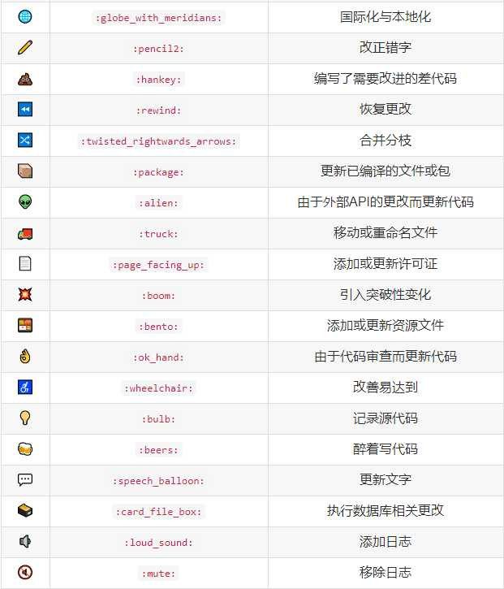

::: tip Git

版本控制工具

:::

## gitmoji

> Gitmoji 是一个标准化 Git commit 的工具。在提交消息中使用 emoji 表情符号，提供了一种只需查看使用的表情符号来识别提交的目的或意图的简单方法。这里有足够的表情符号供你不同的需求。

    <a target="_blank" href="https://gitmoji.carloscuesta.me/" data-draft-node="block"
  data-draft-type="link-card" data-image="https://pic2.zhimg.com/v2-f63c28a54be0362584d3ecad72417ae9_ipico.jpg"
  data-image-width="2048" data-image-height="2048" class="LinkCard LinkCard--hasImage" data-za-detail-view-id="172">
    
  
  
    
      gitmoji
      
      
        
          <svg class="Zi Zi--InsertLink" fill="currentColor" viewBox="0 0 24 24" width="17" height="17">
            <path
              d="M13.414 4.222a4.5 4.5 0 1 1 6.364 6.364l-3.005 3.005a.5.5 0 0 1-.707 0l-.707-.707a.5.5 0 0 1 0-.707l3.005-3.005a2.5 2.5 0 1 0-3.536-3.536l-3.005 3.005a.5.5 0 0 1-.707 0l-.707-.707a.5.5 0 0 1 0-.707l3.005-3.005zm-6.187 6.187a.5.5 0 0 1 .638-.058l.07.058.706.707a.5.5 0 0 1 .058.638l-.058.07-3.005 3.004a2.5 2.5 0 0 0 3.405 3.658l.13-.122 3.006-3.005a.5.5 0 0 1 .638-.058l.069.058.707.707a.5.5 0 0 1 .058.638l-.058.069-3.005 3.005a4.5 4.5 0 0 1-6.524-6.196l.16-.168 3.005-3.005zm8.132-3.182a.25.25 0 0 1 .353 0l1.061 1.06a.25.25 0 0 1 0 .354l-8.132 8.132a.25.25 0 0 1-.353 0l-1.061-1.06a.25.25 0 0 1 0-.354l8.132-8.132z">
            </path>
          </svg>
          gitmoji.carloscuesta.me
      
      
          
      
  
    </a>

### 示范

### 使用效果如下

